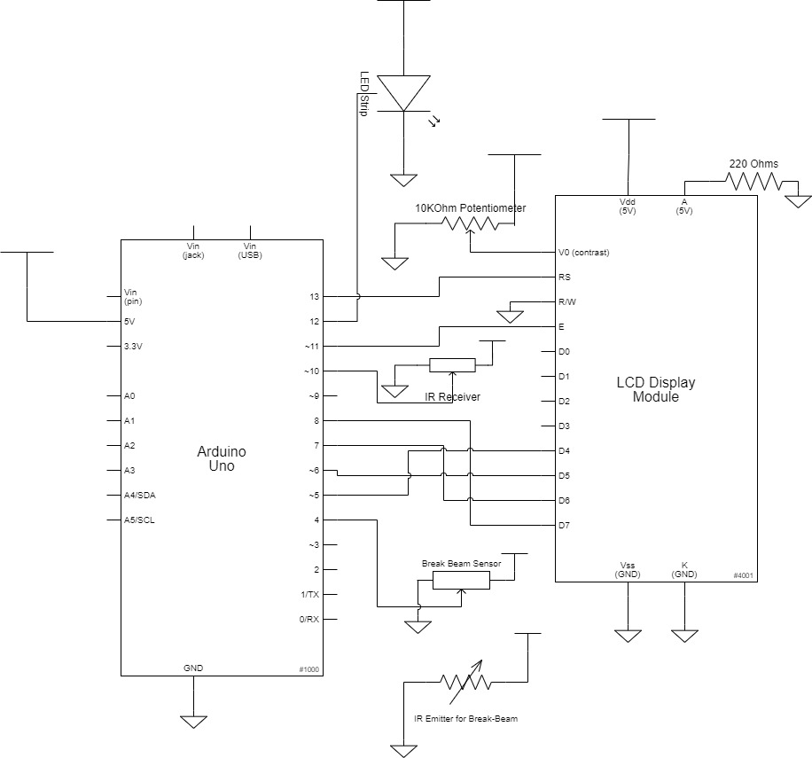

# AntiSimpSystem
Formally known as the Response Time Indicator. This device is box that tells you how long to wait to respond to someone, based on how petty you are feeling. To use it, simply press start on the remote when you send a message, and stop when you receive a message back. Feel free to indicate how petty you are feeling using the numbers on the remote (0-9). Put your phone in the box, and don't take it out until it's green, or the box will be mean to you. But it's okay, because you need to hear it. 

# Full Write Up
For an extensive look into the origins of the Anti-Simp System and the thought process behind it, please visit
https://courses.ideate.cmu.edu/60-223/s2021/work/anti-simp-system/

To run and use the code yourself, see below!

# Run the Code
Program your Arduino with main.ino, and use this pinout. You will need to provide your own box, with the LED and LCD screen on top. 

# Demo Video

https://user-images.githubusercontent.com/72577460/217118100-5752db65-87aa-481b-98e2-af0b081740ac.mp4

